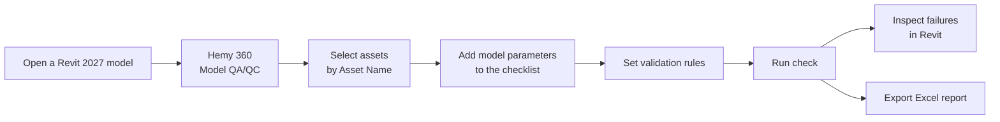
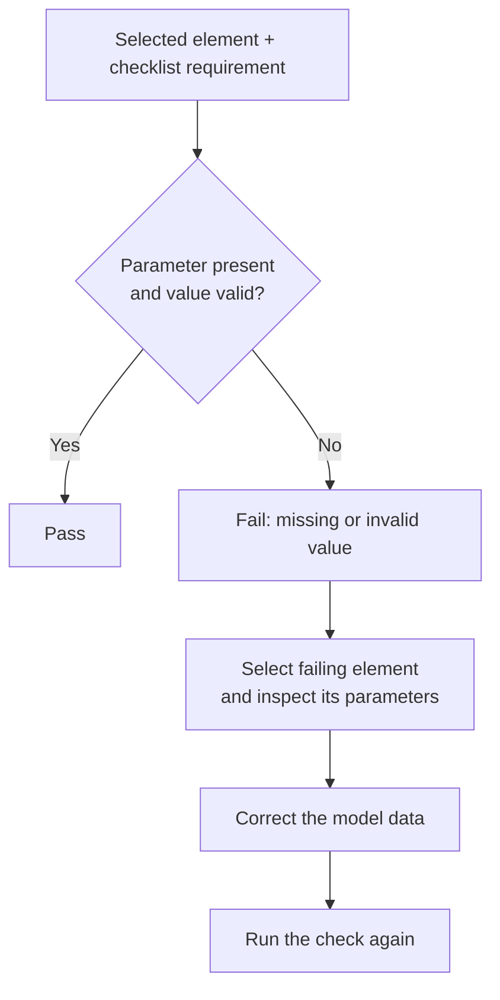

# Hemy 360 Model QA/QC for Revit 2027

Hemy 360 Model QA/QC checks whether selected Revit elements contain the asset information required for handover. You choose the parameters and validation rules, run a check, review failures in the model, and export an Excel report.

[Download the Revit 2027 plugin ZIP](./Hemy360ModelQAQCRevit2027.zip)

> **Version and source:** This package is for **Revit 2027**. It contains a compiled add-in, not the editable C# source. See [Source availability](#source-availability).

## Install

1. Close Revit.
2. Download and extract `Hemy360ModelQAQCRevit2027.zip`.
3. In File Explorer, enter `%APPDATA%\Autodesk\Revit\Addins\2027\` in the address bar. Create the `2027` folder if needed.
4. Copy the extracted **manifest** and **Hemy360.Qaqc** folder into that `2027` folder. Keep the layout below.
5. Start Revit 2027. In the ribbon, open **Hemy 360 → Model QA/QC → Model QA/QC**. The panel opens as a dockable pane, usually on the right.

```text
%APPDATA%\Autodesk\Revit\Addins\2027\
├── Hemy360.Qaqc.addin
└── Hemy360.Qaqc\
    └── Hemy360.Qaqc.dll
```

The ZIP also contains a `.pdb` debug-symbol file and the original technical README in the `Hemy360.Qaqc` folder. Keeping them with the DLL is fine.

## Use the checker

1. **Open the model** you want to check in Revit 2027, then open the Hemy 360 panel.
2. **Choose elements by Asset Name.** The panel lists model elements with a non-empty **Asset Name**. Select the assets to check.
3. **Build a checklist.** Search for a project or shared parameter defined in the model, then add it to the checklist. Add as many requirements as needed. The checklist starts empty, so add at least one requirement before running.
4. **Set the validation rule** for each requirement. Presence checks require a value; other rules can check a GUID, number, or allowed values. Where a model parameter matches a Hemy 360 default name, the plugin proposes its matching rule. Review the rule before running.
5. **Run the check.** Review the pass/fail results. Selecting a failing result in the panel selects and zooms to that element in Revit, so you can inspect it in context.
6. **Export to Excel** to save the run. The workbook contains **Summary**, **Elements**, and **Parameter detail** sheets. The Summary records the checklist used for that run.



### Reading a result



The add-in is **read-only**: it reports problems but does not change Revit parameters. Correct values in the model with your normal editing workflow, then rerun the check.

## Shortcuts and configuration

- **Checklist templates:** The package describes two optional templates, **Door — Hemy360 IR** and **MEP Equipment — Hemy360 IR**. Loading a template replaces the current checklist. You can also save a checklist as your own template.
- **Parameter mapping:** On first run, the add-in creates `%APPDATA%\Hemy Solutions\Hemy 360 QAQC\settings.json`. If your model uses different parameter names, edit the mappings there and restart Revit. Shared parameter GUIDs can be used so a check survives a parameter rename.
- **Type parameters:** By default, a value on the family type can satisfy a requirement for an instance. Set `IncludeTypeParameters` to `false` in `settings.json` if the data must be on each instance.
- **Newly added parameters:** If you add a project or shared parameter while the panel is open, rerun the check or reopen the panel to refresh the parameter list.

## If the panel does not appear

Check that you are using Revit **2027**, that `Hemy360.Qaqc.addin` is directly inside the `2027` add-in folder, and that its neighboring `Hemy360.Qaqc` folder contains `Hemy360.Qaqc.dll`. Restart Revit after changing the files. The package documentation says the compiled add-in has not been verified through a first run inside Revit, so a host-specific issue may still need investigation.

## Package contents

- `Hemy360.Qaqc.addin` — Revit add-in manifest
- `Hemy360.Qaqc/Hemy360.Qaqc.dll` — compiled plugin
- `Hemy360.Qaqc/Hemy360.Qaqc.pdb` — debug symbols
- `Hemy360.Qaqc/README.md` — original technical documentation

## Source availability

The supplied ZIP does **not** contain the C# source files, project file, tests, or installer scripts mentioned in its internal README. This repository currently stores the compiled package only. To publish editable source, the original `src/Hemy360.Qaqc`, `tests/Hemy360.Qaqc.Verify`, and `installer` folders must be recovered from the development project.
